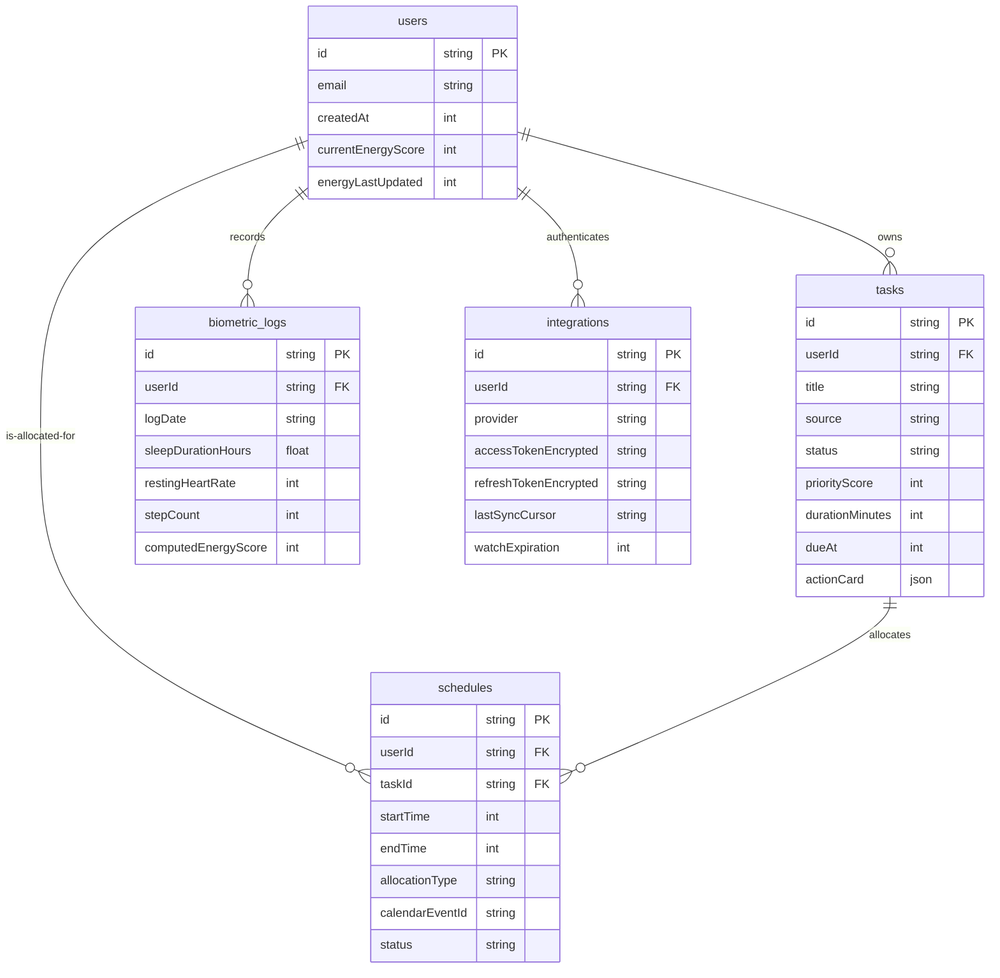

# Production Database Design Specification (Convex)

## Project: The Last-Minute Life Saver
### Document Version: 1.0.0
### Database Paradigm: Reactive Document Store
### Core Database Language: TypeScript (Convex Query Language & Schema Builder)
### Target Platform: Convex Edge Runtime

---

## Section 1: Core Paradigm & Language Selection

To support a real-time, highly responsive dashboard with immediate card updates, "The Last-Minute Life Saver" uses **Convex** as its primary database.

### 1.1 Rationale for Choosing Convex
1. **End-to-End Reactivity**: Convex replaces traditional REST polling or manual WebSocket wiring. Clients subscribe to queries, and Convex automatically recalculates and pushes the new state over a persistent WebSocket connection whenever the underlying data changes.
2. **Type-Safe TypeScript Schemas**: The entire database schema, queries, and mutations are defined in TypeScript. This ensures type safety from the SvelteKit frontend to the database layer, eliminating runtime serialization bugs.
3. **Acid Transaction Guarantees**: Convex queries and mutations are executed as transactions on the edge. If a mutation fails or encounters a race condition, the entire operation is rolled back, preventing orphaned tasks or duplicate focus blocks.
4. **Serverless Auto-Scaling**: Convex scales compute and storage automatically without manual database configuration, partitioning, or connection pool provisioning.

### 1.2 Data Access Language
The database query and data definition language is **TypeScript**.
- **Data Definition**: Done via Convex's Schema DSL in `convex/schema.ts` using type validators.
- **Data Queries**: Written as JavaScript/TypeScript functions running inside Convex's transactional engine, using JavaScript filter and index cursors.
- **Go/Python Integration**: The Go and Python services interact with Convex using type-safe JSON payloads via Convex's **HTTP Mutation API** (`POST /api/mutation/tableName`).

---

## Section 2: Entity-Relationship Diagram & Entity Specification

### 2.1 Entity-Relationship Diagram (ERD)

The diagram below represents the logical relationships and cardinality between Convex document tables. Note that foreign keys are represented as references using Convex's built-in `v.id("tableName")` type validator.



---

### 2.2 Table & Entity Catalog

#### 2.2.1 Table: `users`
Represents the core user profile, caching their current active energy state.
- **Function**: Anchors all multi-tenant relationships and caches the client-side calculated daily energy levels.

| Field Name | Data Type | Validation Rule | Description |
| :--- | :--- | :--- | :--- |
| `_id` | `v.id("users")` | Built-in | Unique identifier (Primary Key). |
| `email` | `v.string()` | Unique | User's Google email address. |
| `createdAt` | `v.number()` | Positive Integer | Epoch millisecond timestamp of user registration. |
| `currentEnergyScore` | `v.number()` | Min: 1, Max: 10 | Current physical/cognitive energy index. |
| `energyLastUpdated` | `v.number()` | Positive Integer | Epoch timestamp of the last biometric sync. |

#### 2.2.2 Table: `tasks`
Holds all tasks ingested from Gmail, Google Tasks, or manual user input.
- **Function**: Main task repository. Evaluated by the LangGraph agent to produce 1-Tap Action Cards.

| Field Name | Data Type | Validation Rule | Description |
| :--- | :--- | :--- | :--- |
| `_id` | `v.id("tasks")` | Built-in | Unique identifier. |
| `userId` | `v.id("users")` | Required | Foreign Key pointing to the task owner. |
| `title` | `v.string()` | Max Length: 256 | Summarized task heading. |
| `source` | `v.string()` | Sourced: `GMAIL`, `TASKS`, `MANUAL` | Original source of the task. |
| `status` | `v.string()` | Enumerated: `QUEUED`, `ACTIVE`, `COMPLETED`, `IGNORED` | Current task lifecycle status. |
| `priorityScore` | `v.number()` | Min: 1, Max: 100 | Dynamic urgency rank computed by Gemini. |
| `durationMinutes` | `v.number()` | Positive Integer | Estimated resolution duration. |
| `dueAt` | `v.number()` | Positive Integer | Hard deadline epoch timestamp. |
| `actionCard` | `v.object(...)` | Optional Map | Contains pre-compiled action metadata (e.g. Gmail drafts). |

#### 2.2.3 Table: `schedules`
Represents scheduled time-blocks allocated for resolving tasks.
- **Function**: Tracks focus blocks, micro-gaps, and tentative "Ghost Blocks" on the user's calendar.

| Field Name | Data Type | Validation Rule | Description |
| :--- | :--- | :--- | :--- |
| `_id` | `v.id("schedules")` | Built-in | Unique identifier. |
| `userId` | `v.id("users")` | Required | Reference to the owner's calendar. |
| `taskId` | `v.id("tasks")` | Required | Reference to the task being scheduled. |
| `startTime` | `v.number()` | Positive Integer | Start epoch millisecond timestamp. |
| `endTime` | `v.number()` | Positive Integer | End epoch millisecond timestamp. |
| `allocationType` | `v.string()` | Enumerated: `GHOST_BLOCK`, `MICRO_GAP` | Visual and behavioral grouping parameter. |
| `calendarEventId`| `v.string()` | Required | Google Calendar API Event Reference string. |
| `status` | `v.string()` | Enumerated: `RESERVED`, `DISSOLVED`, `COMMITTED` | Lifecycle of the calendar event block. |

#### 2.2.4 Table: `biometric_logs`
Stores the daily biometric aggregates retrieved via Health Connect.
- **Function**: Archives daily biological statistics to refine machine learning profiling of user energy levels.

| Field Name | Data Type | Validation Rule | Description |
| :--- | :--- | :--- | :--- |
| `_id` | `v.id("biometric_logs")`| Built-in | Unique identifier. |
| `userId` | `v.id("users")` | Required | Owner reference. |
| `logDate` | `v.string()` | Format: `YYYY-MM-DD` | Calendar date of target log. |
| `sleepDurationHours`| `v.float64()` | Positive Float | Hours of sleep registered. |
| `restingHeartRate`| `v.number()` | Positive Integer | Heart beats per minute baseline. |
| `stepCount` | `v.number()` | Positive Integer | Total physical step count for the day. |
| `computedEnergyScore`| `v.number()`| Min: 1, Max: 10 | The resultant daily energy rating. |

#### 2.2.5 Table: `integrations`
Houses OAuth connection parameters and access tokens for Workspace integrations.
- **Function**: Used by the Go Gateway to fetch refresh tokens, encrypt/decrypt them, and manage session expirations.

| Field Name | Data Type | Validation Rule | Description |
| :--- | :--- | :--- | :--- |
| `_id` | `v.id("integrations")`| Built-in | Unique identifier. |
| `userId` | `v.id("users")` | Required | Reference to the integrated user account. |
| `provider` | `v.string()` | Sourced: `GOOGLE_WORKSPACE` | OAuth identity provider name. |
| `accessTokenEncrypted`| `v.string()`| Required | Base64 AES-256 encrypted access token. |
| `refreshTokenEncrypted`| `v.string()`| Required | Base64 AES-256 encrypted refresh token. |
| `lastSyncCursor` | `v.string()` | Optional | Synchronization state cursor for API sync. |
| `watchExpiration`| `v.number()` | Positive Integer | Gmail watch expiration timestamp. |

---

## Section 3: TypeScript Database Schema Definition (`convex/schema.ts`)

This file is deployed directly to Convex. It enforces type validation on write operations and defines indexing constraints.

```typescript
import { defineSchema, defineTable } from "convex/server";
import { v } from "convex/values";

export default defineSchema({
  // Users Collection
  users: defineTable({
    email: v.string(),
    createdAt: v.number(),
    currentEnergyScore: v.number(),
    energyLastUpdated: v.number(),
  }).index("by_email", ["email"]),

  // Tasks Collection
  tasks: defineTable({
    userId: v.id("users"),
    title: v.string(),
    source: v.union(v.literal("GMAIL"), v.literal("TASKS"), v.literal("MANUAL")),
    status: v.union(
      v.literal("QUEUED"),
      v.literal("ACTIVE"),
      v.literal("COMPLETED"),
      v.literal("IGNORED")
    ),
    priorityScore: v.number(),
    durationMinutes: v.number(),
    dueAt: v.number(),
    actionCard: v.optional(
      v.object({
        actionType: v.union(
          v.literal("GMAIL_DRAFT"),
          v.literal("CALENDAR_BOOKING"),
          v.literal("BILL_PAY")
        ),
        savesMinutes: v.number(),
        draftId: v.optional(v.string()),
        payloadJson: v.string(), // Stringified JSON configuration payload
      })
    ),
  })
    .index("by_user", ["userId"])
    .index("by_user_status_priority", ["userId", "status", "priorityScore"])
    .index("by_due_date", ["userId", "dueAt"]),

  // Schedules / Calendar Allocations Collection
  schedules: defineTable({
    userId: v.id("users"),
    taskId: v.id("tasks"),
    startTime: v.number(),
    endTime: v.number(),
    allocationType: v.union(v.literal("GHOST_BLOCK"), v.literal("MICRO_GAP")),
    calendarEventId: v.string(),
    status: v.union(
      v.literal("RESERVED"),
      v.literal("DISSOLVED"),
      v.literal("COMMITTED")
    ),
  })
    .index("by_user", ["userId"])
    .index("by_task", ["taskId"])
    .index("by_time_window", ["userId", "startTime", "endTime"]),

  // Biometric Logs Collection
  biometric_logs: defineTable({
    userId: v.id("users"),
    logDate: v.string(), // ISO format: YYYY-MM-DD
    sleepDurationHours: v.number(),
    restingHeartRate: v.number(),
    stepCount: v.number(),
    computedEnergyScore: v.number(),
  })
    .index("by_user", ["userId"])
    .index("by_user_date", ["userId", "logDate"]),

  // OAuth Integrations Collection
  integrations: defineTable({
    userId: v.id("users"),
    provider: v.string(),
    accessTokenEncrypted: v.string(),
    refreshTokenEncrypted: v.string(),
    lastSyncCursor: v.optional(v.string()),
    watchExpiration: v.number(),
  }).index("by_user_provider", ["userId", "provider"]),
});
```

---

## Section 4: Relationship Modeling & Integrity Boundaries

Unlike traditional SQL databases, Convex maintains relationships using document references. Relational integrity is enforced using the following transactional patterns:

### 4.1 Referential Integrity
- **No Cascade Deletion by Default**: Convex document storage does not support automatic cascade deletes at the engine level.
- **Application-Layer Cascades**: Cascade deletions are managed programmatically inside Convex Mutations. For example, when a user account is deleted, the mutation triggers sequential purges across all referencing collections:

```typescript
// convex/users.ts - Cascaded User Purge
import { mutation } from "./_generated/server";
import { v } from "convex/values";

export const deleteUserAccount = mutation({
  args: { userId: v.id("users") },
  handler: async (ctx, args) => {
    // 1. Fetch and delete all schedules
    const schedules = await ctx.db
      .query("schedules")
      .withIndex("by_user", (q) => q.eq("userId", args.userId))
      .collect();
    for (const schedule of schedules) {
      await ctx.db.delete(schedule._id);
    }

    // 2. Fetch and delete all tasks
    const tasks = await ctx.db
      .query("tasks")
      .withIndex("by_user", (q) => q.eq("userId", args.userId))
      .collect();
    for (const task of tasks) {
      await ctx.db.delete(task._id);
    }

    // 3. Delete Integrations
    const integration = await ctx.db
      .query("integrations")
      .withIndex("by_user_provider", (q) => q.eq("userId", args.userId))
      .unique();
    if (integration) await ctx.db.delete(integration._id);

    // 4. Finally, delete the User profile
    await ctx.db.delete(args.userId);
  },
});
```

### 4.2 Transaction Isolation & Concurrency
- Convex runs mutations inside serializable ACID transactions.
- During scheduling loops, if two separate processes (e.g. Go backend and User Client UI) attempt to edit the same calendar slot simultaneously, Convex detects the write conflict. The second transaction is aborted and retried automatically on the edge, preventing double-booking.

---

## Section 5: Database Functions Map (Queries, Mutations, Actions)

Convex functions are organized into Queries (read-only, reactive), Mutations (write-only, transactional), and Actions (asynchronous, side-effect capable).

```
┌────────────────────────────────────────────────────────┐
│               Convex Function Boundary                 │
├────────────────────────────────────────────────────────┤
│ - Queries (Subscribed by SvelteKit Web UI)             │
│   ├── getActiveTasks(userId)                           │
│   └── getAllocatedSchedules(userId)                    │
│                                                        │
│ - Mutations (Writes triggered by Go Gateway / Client)  │
│   ├── createTask(title, priority, dueAt)                │
│   ├── completeTask(taskId)                             │
│   └── updateEnergy(score)                              │
│                                                        │
│ - Actions (External API calls / Webhook triggers)      │
│   ├── runAgentTriage(taskId) -> Calls LangGraph Cloud   │
│   └── dispatchGmailSync(userId) -> Calls Go Gateway    │
└────────────────────────────────────────────────────────┘
```

### 5.1 Reactive Queries (Reads SvelteClient)

```typescript
// convex/queries.ts
import { query } from "./_generated/server";
import { v } from "convex/values";

// Fetches the real-time active task cards sorted by priority
export const getActiveTasks = query({
  args: { userId: v.id("users") },
  handler: async (ctx, args) => {
    return await ctx.db
      .query("tasks")
      .withIndex("by_user_status_priority", (q) =>
        q.eq("userId", args.userId).eq("status", "ACTIVE")
      )
      .order("desc")
      .collect();
  },
});

// Fetches active calendar scheduling coordinates
export const getActiveSchedules = query({
  args: { userId: v.id("users") },
  handler: async (ctx, args) => {
    return await ctx.db
      .query("schedules")
      .withIndex("by_user", (q) => q.eq("userId", args.userId))
      .filter((q) => q.eq(q.field("status"), "RESERVED"))
      .collect();
  },
});
```

---

### 5.2 Transactional Mutations (Writes GoGateway / Client)

```typescript
// convex/mutations.ts
import { mutation } from "./_generated/server";
import { v } from "convex/values";

// Triggered by the Go Gateway when a new task is triaged and structured
export const ingestTriagedTask = mutation({
  args: {
    userId: v.id("users"),
    title: v.string(),
    source: v.union(v.literal("GMAIL"), v.literal("TASKS"), v.literal("MANUAL")),
    priorityScore: v.number(),
    durationMinutes: v.number(),
    dueAt: v.number(),
    actionCard: v.optional(
      v.object({
        actionType: v.union(
          v.literal("GMAIL_DRAFT"),
          v.literal("CALENDAR_BOOKING"),
          v.literal("BILL_PAY")
        ),
        savesMinutes: v.number(),
        draftId: v.optional(v.string()),
        payloadJson: v.string(),
      })
    ),
  },
  handler: async (ctx, args) => {
    return await ctx.db.insert("tasks", {
      userId: args.userId,
      title: args.title,
      source: args.source,
      status: "ACTIVE",
      priorityScore: args.priorityScore,
      durationMinutes: args.durationMinutes,
      dueAt: args.dueAt,
      actionCard: args.actionCard,
    });
  },
});

// Updates the user's energy score, triggered by SvelteKit after Health Connect evaluation
export const updateUserEnergy = mutation({
  args: {
    userId: v.id("users"),
    score: v.number(),
  },
  handler: async (ctx, args) => {
    const timestamp = Date.now();
    await ctx.db.patch(args.userId, {
      currentEnergyScore: args.score,
      energyLastUpdated: timestamp,
    });
    
    // Also record the log inside the history table
    const dateStr = new Date(timestamp).toISOString().split("T")[0];
    const existingLog = await ctx.db
      .query("biometric_logs")
      .withIndex("by_user_date", (q) =>
        q.eq("userId", args.userId).eq("logDate", dateStr)
      )
      .unique();

    if (existingLog) {
      await ctx.db.patch(existingLog._id, { computedEnergyScore: args.score });
    } else {
      await ctx.db.insert("biometric_logs", {
        userId: args.userId,
        logDate: dateStr,
        sleepDurationHours: 8.0, // Default placeholders if Health Connect read is partial
        restingHeartRate: 70,
        stepCount: 5000,
        computedEnergyScore: args.score,
      });
    }
  },
});
```

---

### 5.3 Asynchronous Actions (External Integration Calls)

Actions run in an environment that can execute non-deterministic HTTP requests and write back results via transactional mutations.

```typescript
// convex/actions.ts
import { action } from "./_generated/server";
import { v } from "convex/values";
import { api } from "./_generated/api";

// Triggered when a raw task requires agent processing in Python LangGraph
export const triggerAgentReasoning = action({
  args: {
    userId: v.id("users"),
    taskId: v.id("tasks"),
    taskContent: v.string(),
  },
  handler: async (ctx, args) => {
    const agentEndpoint = "https://python-langgraph-agent-xyz.a.run.app/triage";
    
    // 1. POST raw content to the LangGraph Cloud Run Service
    const response = await fetch(agentEndpoint, {
      method: "POST",
      headers: { "Content-Type": "application/json" },
      body: JSON.stringify({
        userId: args.userId,
        taskId: args.taskId,
        content: args.taskContent,
      }),
    });

    if (!response.ok) throw new Error("LangGraph agent execution failed");
    const result = await response.json();

    // 2. Write the triaged results back to the database via mutation
    await ctx.runMutation(api.mutations.ingestTriagedTask, {
      userId: args.userId,
      title: result.title,
      source: "GMAIL",
      priorityScore: result.priorityScore,
      durationMinutes: result.durationMinutes,
      dueAt: result.dueAt,
      actionCard: {
        actionType: result.actionType,
        savesMinutes: result.savesMinutes,
        draftId: result.draftId,
        payloadJson: JSON.stringify(result.payload),
      },
    });
  },
});
```
