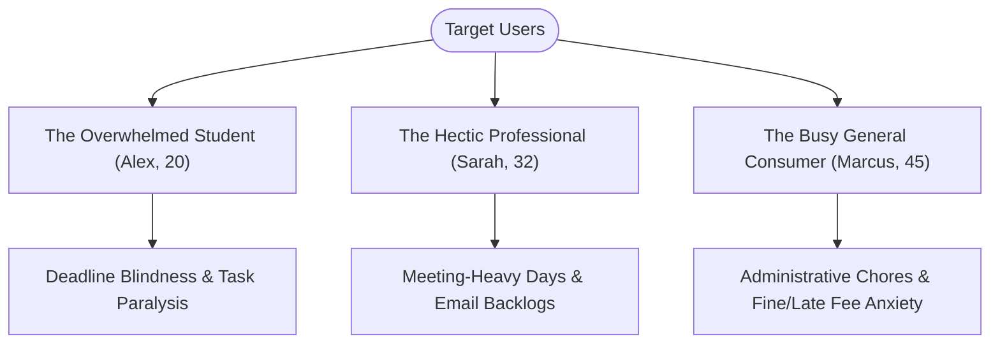
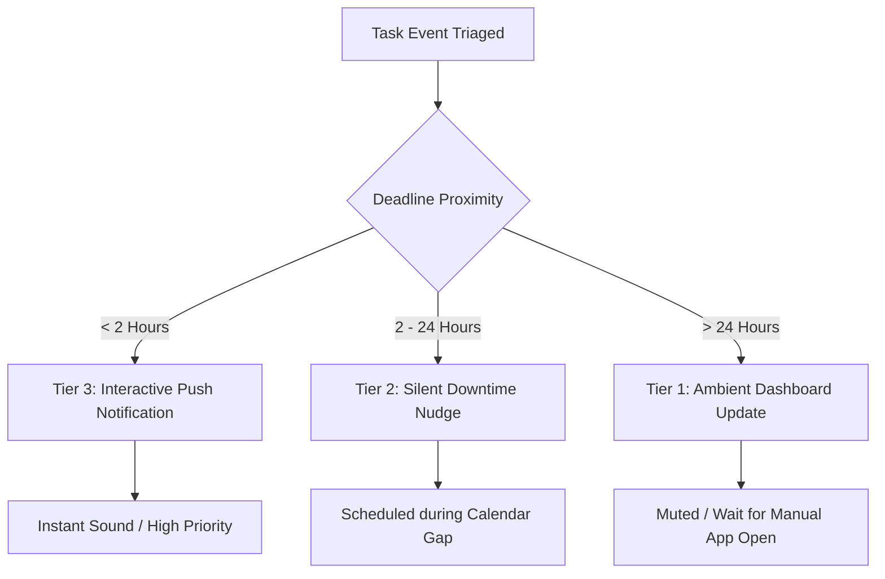
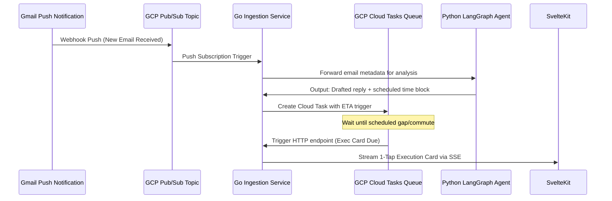

# Product Requirements Document (PRD)

## Project Name: The Last-Minute Life Saver
### Version: 1.0 (MVP)
### Author: Principal Product Manager, Next-Gen AI Assistants & Workspace Integration
### Target Event: Google Vibe2Ship Hackathon

---

## Section 1: Executive Summary

### 1.1 Problem Statement
Existing productivity and task management tools (e.g., Apple Reminders, Google Tasks, Todoist) are fundamentally passive. They rely on static, time-based alerts that users must manually set, easily ignore, or snooze indefinitely. This passivity leads to:
- **Task Paralysis**: When confronted with a high-stakes, complex task (e.g., filing a tax form, drafting a critical client proposal, or writing a research outline), the user experiences cognitive overload and freezes. The passive reminder acts as an external stressor rather than a resolution catalyst.
- **Context-Switching Fatigue**: Users constantly toggle between academic platforms (LMS), corporate tools, emails, and personal calendars, wasting significant cognitive energy tracking *what* needs to be done instead of *doing* it.
- **Deadline Blindness**: Busy individuals struggle to visualize how tasks fit into the micro-gaps of their daily calendars, leading to missed payments, late academic submissions, and degraded professional reliability.

### 1.2 Proposed Product Vision
**"The Last-Minute Life Saver"** is a proactive, context-aware AI productivity companion built on a **High Autonomy with 1-Tap Execution** philosophy. Rather than simply alerting the user to an upcoming deadline, the agent runs in the background to pre-compile the required assets and execute the administrative heavy lifting. 

When a task is due, the AI presents a completed resolution (e.g., a fully drafted email reply in Gmail, a pre-carved focus slot on Google Calendar, a pre-populated utility payment deep link, or a compiled briefing package) on a single **1-Tap Action Card**. The user is transitioned from an overwhelmed task organizer to a single-click executor, drastically reducing cognitive friction and eliminating task inertia.

### 1.3 North Star & Success Metrics
To evaluate the product’s real-world impact and effectiveness during the hackathon, we will track the following four KPIs:

| Metric Name | Definition | Target Goal (MVP) |
| :--- | :--- | :--- |
| **Task Completion Rate (TCR)** | Percentage of queued tasks successfully resolved prior to their deadlines. | **85%** of all tracked tasks |
| **Time-to-Action (TTA)** | Median time (in seconds) from the user receiving a proactive card to executing the resolution. | **< 5 seconds** |
| **Cognitive Friction Index (CFI)** | Ratio of user clicks/key-inputs to agent-executed backend steps. | **0.1** (1 user click per 10 agent backend steps) |
| **Action-to-Noise Ratio (ANR)** | Percentage of agent-proposed 1-tap actions accepted and executed by the user. | **> 75%** approval rate |

---

## Section 2: Customer Problem & Jobs-to-be-Done (JTBD)

To ground our product features in real human needs, we define three primary user personas experiencing the pain of deadline management:

### 2.1 Target Personas



#### 2.1.1 The Overwhelmed Student (Alex, 20)
- **Context**: Full-time undergraduate student balancing coursework, exams, part-time jobs, and social obligations.
- **Pain Points**: Suffers from "deadline blindness" where major papers and exams sneak up. When stressed, he experiences task paralysis and procrastinates until the last minute, leading to high anxiety and sub-optimal grades.
- **Behavior**: Uses multiple siloed systems (Canvas LMS, Gmail, physical planners) but fails to synthesize them into an actionable schedule.

#### 2.1.2 The Hectic Professional (Sarah, 32)
- **Context**: Project Manager at a high-growth startup, managing multiple client accounts, cross-functional teams, and administrative deliverables.
- **Pain Points**: Calendar is fragmented by back-to-back meetings. Important email follow-ups are delayed because she lacks consecutive focus blocks to formulate professional responses.
- **Behavior**: Relies on starring Gmail messages, but they accumulate and get buried, causing anxiety about breaking SLAs.

#### 2.1.3 The Busy General Consumer (Marcus, 45)
- **Context**: Freelancer and parent managing shifting client deadlines alongside household chores (utility bills, car registrations, medical checkups).
- **Pain Points**: Forgets recurring administrative tasks because they don't appear on his core work calendar. Stressed by the risk of late fees, penalty charges, and service interruptions.
- **Behavior**: Ignores traditional push notifications because they arrive when he is actively working or driving.

---

### 2.2 Jobs-to-be-Done (JTBD) Framework

Applying the JTBD methodology, we define the core functional and emotional requirements of our personas:

- **For the Overwhelmed Student (Alex)**:
  * *Situation*: **When I** have a major academic paper due in 48 hours,
  * *Action*: **I want** the system to automatically carve out dedicated focus blocks and compile relevant background research sources in my Workspace,
  * *Benefit*: **So that** I can overcome task paralysis and complete my assignment on time without extreme stress.

- **For the Hectic Professional (Sarah)**:
  * *Situation*: **When** a critical client email requires a follow-up action while I am in meetings,
  * *Action*: **I want** the agent to draft a contextual reply based on our past correspondence and present it to me during a quiet calendar gap,
  * *Benefit*: **So that** I can maintain client trust and hit response SLAs with a single tap.

- **For the Busy General Consumer (Marcus)**:
  * *Situation*: **When** utility bills are due on varying dates throughout the month,
  * *Action*: **I want** the agent to identify small gaps in my schedule, pre-fill payment forms, and provide a direct secure checkout link,
  * *Benefit*: **So that** I can clear administrative tasks in under 15 seconds without incurring late fees.

---

## Section 3: Solution Overview & Features (MoSCoW Framework)

The solution is architected around a mobile-responsive web dashboard that integrates directly with Google Workspace and device telemetry to proactively manage productivity.

```
┌─────────────────────────────────────────────────────────────────────────┐
│                       MoSCoW Feature Matrix                             │
├────────────────────────────────────────┬────────────────────────────────┤
│               MUST HAVE                │           SHOULD HAVE          │
│  - Intelligent Task Triaging           │ - Context-Aware Nudging        │
│  - Context-Aware Micro-Scheduling      │ - Voice-Enabled Companion      │
│  - 1-Tap Execution Cards (Gmail, Cal)  │ - "Ghost" Time-Blocking        │
│                                        │ - Android Health Connect Sync  │
│                                        │ - Collaborative "SOS" Drafts    │
│                                        │ - "Pre-flight Check" Bundles   │
├────────────────────────────────────────┴────────────────────────────────┤
│                              WON'T HAVE                                 │
│  - Fully Autonomous Execution without User Approval (Guardrails)         │
└─────────────────────────────────────────────────────────────────────────┘
```

### 3.1 Must Have (MVP)

#### 3.1.1 Intelligent Task Triaging (Gemini-Powered)
- **Description**: Evaluates the user's task inbox (sourced from Google Tasks and Gmail scrapes) and prioritizes them dynamically.
- **Mechanism**: The Gemini API (via `gemini-2.0-flash` or `gemini-1.5-pro`) processes task metadata (due date, description, estimated difficulty, history of delays) to calculate a real-time **Triage Priority Score (1-100)**.
- **Value**: Instead of sorting purely by due date, the AI weights tasks by cognitive friction and complexity, bubbling up high-priority/high-effort tasks that require immediate preparation.

#### 3.1.2 Context-Aware Micro-Scheduling
- **Description**: Scans the user's Google Calendar to find unused micro-gaps (e.g., 10, 15, or 30-minute windows between meetings) and schedules appropriate low-effort tasks.
- **Mechanism**: The backend pulls free-busy data from Google Calendar API. If it finds a 15-minute gap, and the user's current energy state is appropriate, it assigns a low-effort task (e.g., "Review draft response to Project Update" or "Process electricity bill payment") into that slot.
- **Value**: Turns dead calendar time into productive recovery windows, preventing task accumulation.

#### 3.1.3 1-Tap Execution Cards (Workspace Integrations)
- **Description**: The primary UI interface. Each task card contains pre-compiled, actionable payloads that resolve the task upon user confirmation.
- **Integrations**:
  - **Gmail API**: Automatically generates email drafts based on past correspondence. When the user taps "Send," the agent transitions the draft to the user's Gmail Outbox.
  - **Google Calendar API**: Pre-populates calendar event slots with descriptions, locations, and conference links.
  - **Google Pay & Chrome Autofill APIs**: Pulls direct invoice links and pre-fills payment metadata, presenting a secure gateway button to complete utility or subscription payments.

---

### 3.2 Should Have

#### 3.2.1 Context-Aware Nudging (Intrusiveness Tiering)
- **Description**: Adapts notification delivery based on the user's current environment, physical location, and schedule status.
- **Mechanism**: Leverages Google Calendar busy states and mobile sensor telemetry (via Android API integration) to assess receptivity. If the user is currently in a calendar-marked meeting or driving, notifications are muted and deferred.

#### 3.2.2 Voice-Enabled Companion (Gemini Live Integration)
- **Description**: Enables voice-guided task management, allowing hands-free task triaging.
- **Mechanism**: Utilizes Gemini Live's low-latency, bidirectional audio streaming capabilities. Users can review their smart queue, adjust scheduling blocks, and approve drafts via conversational voice commands during a quiet walk or commute.

#### 3.2.3 "Ghost" Time-Blocking & Self-Dissolving Reserve Pools
- **Description**: Proactively reserves calendar blocks on Google Calendar to ensure the user has sufficient time to complete upcoming complex tasks.
- **Mechanism**: The agent reserves placeholder blocks (labeled "Ghost Focus Blocks") before a deadline. If the user completes the task early (logged via Google Tasks completion webhooks), the placeholder block is automatically deleted or converted into an open "Recreation Block" on the user's calendar.

#### 3.2.4 Biometric & Cognitive Load Sync (Android Health Connect API)
- **Description**: Synchronizes with biometric data on the user’s mobile device to predict physical and mental exhaustion levels.
- **Mechanism**: Syncs with Android's Health Connect API to read sleep efficiency metrics, resting heart rate, and step counts. It calculates a daily **Energy Score (1-10)**. High-cognitive-load tasks (e.g., "Draft project proposal") are pushed to periods of high predicted energy, while low-cognitive-load tasks (e.g., "Approve bill") are scheduled for low-energy dips.

#### 3.2.5 Collaborative "SOS" Delegation & Extension Drafts
- **Description**: Triggers a safety net if a task's deadline is approaching and the progress indicator remains low.
- **Mechanism**: When a deadline is less than 6 hours away and the task status is not updated, the agent automatically drafts a polite request for an extension or delegates sub-tasks to collaborators using Gmail drafts or Google Chat cards, ready to be dispatched with 1-tap.

#### 3.2.6 "Pre-flight Check" Workspace Preparation Bundles
- **Description**: Before meetings, interviews, or project deadlines, the agent compiles a comprehensive briefing card.
- **Mechanism**: Gathers relevant materials from Google Drive (Docs, Sheets, Slides) and Gmail history. Using Gemini’s large context window, it summarizes the correspondence history, pre-fills required meeting forms, and attaches the Google Meet link into a single workspace bundle card.

---

### 3.3 Won't Have (Out of Scope for MVP)

#### 3.3.1 Fully Autonomous Execution Without User Confirmation
- **Description**: The agent will never automatically execute high-sensitivity write operations (such as sending emails, finalizing bank/bill payments, or updating shared calendars) without the user physically tapping the confirmation button.
- **Rationale**: Mitigates security and privacy risks. The user remains in control, avoiding accidental financial transfers or inappropriate professional communications due to model hallucinations.

---

## Section 4: Product Experience & Design (UX/UI)

### 4.1 The "1-Tap Action Card" Pattern
The core user interface is built around interactive cards designed to present context, preview assets, and enable swift execution.

```
┌──────────────────────────────────────────────────────────────┐
│  ⚠️ URGENT DEADLINE (1.5h)                  [⚡ Saves 20 mins] │
│  Draft Follow-Up: Acme Corp Proposal                         │
├──────────────────────────────────────────────────────────────┤
│  Recipient: client-leads@acmecorp.com                        │
│  Gmail Draft Preview:                                        │
│  "Hi Team, following up on our sync, I've compiled the       │
│   revised pricing sheet. Let me know if we can proceed..."   │
│                                                              │
│  [📎 Attached: Acme_Pricing_Sheet_v2.pdf]                    │
├──────────────────────────────────────────────────────────────┤
│  [ Approve & Send Draft (Gmail) ]                            │
└──────────────────────────────────────────────────────────────┘
```

#### 4.1.1 Card Structural Components
1. **Context Header**:
   - **Deadline Urgency Indicator**: Visual badges changing color based on time remaining (Red: < 2 hours, Yellow: < 6 hours, Blue: Ambient).
   - **Friction Reduction Estimator**: An indicator estimating the time saved by using the card (e.g., "⚡ Saves 15 mins").
2. **Preparation Asset Preview**:
   - A scrollable, editable window containing the pre-compiled work.
   - For emails: The recipient, subject line, and body text.
   - For payments: The invoice amount, payee name, and a direct Google Pay redirection link.
   - For scheduling: A mini-calendar preview indicating where the "Focus Block" will be inserted.
3. **Single Action Trigger Button**:
   - A prominent button that executes the action. It features micro-animations (e.g., a pulse effect on critical items) and displays a green checkmark animation upon tap to confirm completion.

---

### 4.2 Notification Heuristics
To maintain user trust, "The Last-Minute Life Saver" strictly enforces three tiers of alert delivery:



- **Tier 1: Ambient (Low Priority / > 24 Hours)**:
  - *Heuristic*: Placed silently in the dashboard task queue.
  - *Behavior*: No push notification, no sound, no screen wake. Delivered for low-effort tasks with large completion buffers.
- **Tier 2: Quiet Nudge (Medium Priority / 2 to 24 Hours)**:
  - *Heuristic*: Scheduled for delivery only during verified "Downtime".
  - *Behavior*: Sent as a silent notification badge. Delivered when mobile device sensors suggest the user is inactive and Google Calendar shows a free block.
- **Tier 3: Interactive Flash (High Priority / < 2 Hours)**:
  - *Heuristic*: Immediate delivery.
  - *Behavior*: High-priority push alert with sound and haptic vibration. Displays the card directly on the lock screen, allowing the user to tap "Approve" without opening the full application.

---

## Section 5: Technical Specification & Security

### 5.1 Technical Architecture & Data Flow

The application is built on a highly optimized, decoupled microservices architecture deployed on **Google Cloud Platform (GCP)**. It separates high-concurrency API integrations from stateful AI reasoning workflows to maximize performance, control cold starts, and scale to enterprise demands.

```
                  ┌──────────────────────┐
                  │ SvelteKit + Tailwind │
                  │    (Frontend SPA)    │
                  └──────────▲───┬───────┘
            Server-Sent      │   │
            Events (SSE)     │   │ HTTPS
                             │   ▼
  ┌──────────────────────────┴───┴──────────────────────────┐
  │                   GOOGLE CLOUD RUN                      │
  │                                                         │
  │  ┌────────────────────────┐   ┌──────────────────────┐  │
  │  │  Go Ingestion API      │   │ Python LangGraph Agent│  │
  │  │  (Low Latency / Sync)  ├──►│ (Reasoning / Async)  │  │
  │  └──────────▲─────────────┘   └──────────┬───────────┘  │
  └─────────────┼────────────────────────────┼──────────────┘
                │                            │
                │ Read / Write               │ Tool Calls /
                │ Auth                       │ Context Inference
                ▼                            ▼
  ┌──────────────────────────┐   ┌──────────────────────┐
  │ Google Workspace APIs    │   │      Gemini API      │
  │ (Gmail, Calendar, Tasks) │   │ (Vertex AI SDK)      │
  └──────────────────────────┘   └──────────────────────┘
                ▲                            ▲
                │                            │ Reads State
                │ DB Updates / Cache Sync    │
                ▼                            ▼
  ┌──────────────────────────┐   ┌──────────────────────┐
  │      Convex DB           │◄──┤ Cloud Memorystore    │
  │ (Customer-Managed Key)   │   │     (Redis Cache)    │
  └──────────────────────────┘   └──────────────────────┘
```

#### 5.1.1 Core Components of the Tech Stack

1. **Frontend Tier (SvelteKit + TypeScript + TailwindCSS + SSE)**:
   - **Framework**: SvelteKit is chosen for its compile-time architecture, producing minimal bundle sizes and delivering near-instantaneous page-load times (under 500ms on mobile).
   - **Real-Time Streaming**: Uses **Server-Sent Events (SSE)** via a persistent connection to the Go gateway. This allows the backend to stream 1-Tap Action Cards directly to the dashboard as soon as Gemini finishes planning, with lower battery and memory overhead than WebSockets.
   - **State Management**: Built-in Svelte reactive stores hold local task queues and manage card slide animations.

2. **Ingestion & Integration Service (Go / Golang)**:
   - **Function**: Serves as the primary API Gateway, managing OAuth flow, syncing Google Tasks/Calendar, drafting emails, and handling Google Pay billing triggers.
   - **Design Rationale**: Go compiles to a single binary with negligible memory footprint (~15MB RAM baseline). This allows the service to scale from zero to active state on Cloud Run in under 200 milliseconds, completely mitigating the "cold start" latency penalty that plagues AI apps.

3. **Agent Reasoning & Orchestration Service (Python + LangGraph + Vertex AI)**:
   - **Function**: Manages multi-agent workflow orchestration, context window management, and task prioritization.
   - **Framework**: LangGraph is utilized to construct a stateful directed acyclic graph (DAG) representing the task-triaging pipeline. Different sub-nodes act as specialized agents (e.g., *Schedule Analyst*, *Gmail Draft Writer*, *Biometric Profiler*).
   - **Model Channel**: Interacts with the **Gemini 2.0 Flash / 1.5 Pro** models via the **Google Cloud Vertex AI SDK** for high-reliability, low-latency API calls.

4. **Caching & Database Tier (Convex + Cloud Memorystore Redis)**:
   - **Convex DB**: Used as the core reactive document store to sync task structures, schedules, and user profiles in real-time. SvelteKit binds directly to Convex for sub-millisecond data reactivity.
   - **Memorystore (Redis)**: Caches busy/free time windows pulled from the Google Calendar API, preventing redundant and costly outbound Google API calls during micro-scheduling loops.

---

### 5.2 Event-Driven Scheduling & Job Pipelines

Instead of running continuous server pollers (which waste compute and increase costs), the platform runs on a fully event-driven loop leveraging serverless Google Cloud utilities:



1. **Real-Time Gmail Sync (Cloud Pub/Sub)**:
   - The application registers a watch request with the Gmail API. When a new email arrives, Gmail pushes a real-time notification to a **Google Cloud Pub/Sub** topic.
   - Pub/Sub triggers a push subscription endpoint on the Go Ingestion service, prompting it to download the email thread and forward it to the LangGraph agent for immediate triaging.
2. **Micro-Gap Task Execution (Google Cloud Tasks)**:
   - When the agent schedules a task to be executed during a specific calendar gap (e.g., at 3:15 PM), the Go service programmatically creates a deferred HTTP task in **Google Cloud Tasks**, configured with a target execution time matching the scheduled gap.
   - At exactly 3:15 PM, Cloud Tasks fires the webhook on the Go backend, which immediately pushes the pre-compiled 1-Tap Action Card to SvelteKit via Server-Sent Events. This setup operates with zero polling infrastructure.

---

### 5.3 Security, Privacy & Compliance

Handling corporate emails, personal calendars, and biometrics requires strict security protocols that align with Google’s API User Data Policy.

#### 5.3.1 Granular OAuth Scopes
The platform uses the principle of least privilege, requesting restricted scopes that only allow staging operations:
- `https://www.googleapis.com/auth/gmail.compose` (Compose only: allows creating drafts but blocks the agent from sending emails directly).
- `https://www.googleapis.com/auth/calendar.events` (Manage calendar blocks and tentative reservations).
- `https://www.googleapis.com/auth/tasks` (Structured task list read/write access).

#### 5.3.2 Token Lifecycle & Envelope Encryption (KMS + Convex)
To guarantee security of user authentication credentials, we implement a double-envelope encryption architecture:

```
┌────────────────────────────────────────────────────────┐
│               OAuth Token Encryption                   │
├────────────────────────────────────────────────────────┤
│ 1. Fetch Refresh Token from OAuth Flow.                │
│ 2. Generate a unique local Data Encryption Key (DEK).  │
│ 3. Encrypt Refresh Token with DEK (AES-256-GCM).       │
│ 4. Request GCP Cloud KMS to encrypt the DEK using a    │
│    Customer-Managed Key Encryption Key (KEK).          │
│ 5. Store Encrypted Token and Encrypted DEK in          │
│    Convex.                                             │
└────────────────────────────────────────────────────────┘
```
- **Global Configuration**: Application client secrets and server credentials are saved in **Google Cloud Secret Manager**.
- **At-Rest User Credentials**: individual user OAuth refresh tokens are encrypted at-rest using AES-256-GCM under keys generated dynamically. The encrypted payloads are stored in Convex. The keys themselves are wrapped using a Customer-Managed Encryption Key (CMEK) managed in **Google Cloud KMS**.
- **Decryption Isolation**: Access to KMS decryption is secured via strict Google Cloud IAM policies. Only the Cloud Run service account has execution permission to call the KMS Decrypt API.

#### 5.3.3 Biometric Data Privacy (Health Connect)
- **Local Analytics**: Android Health Connect data (e.g., sleep efficiency, heart rate variability) is read and analyzed locally on the user's mobile device.
- **Ephemeral Scores**: SvelteKit processes the raw biometric metrics locally and sends a single, anonymized **Energy Score (1-10)** value to the backend. No raw biological or biometric data is ever stored on the server or in Convex, ensuring compliance with HIPAA and Google Play health policies.

#### 5.3.4 Compliance & Data Erasure
- **Instant Revocation**: Tapping "Delete Account" fires a webhook that sends an HTTP POST request to `https://oauth2.googleapis.com/revoke?token={token}` to invalidate the Google OAuth session.
- **Hard Purge**: The Go service removes the user's document from Convex and instructs Secret Manager / KMS to scrub cached records, leaving zero traces of PII data.

---

## Section 6: Risks & Mitigations

| Identified Risk | Risk Severity | Target Impacted | Mitigation Strategy |
| :--- | :---: | :---: | :--- |
| **AI Hallucinations in Drafts/Schedules** | **High** | Product Trust | **Draft Isolation Policy**: The agent cannot send emails directly. It creates drafts inside Gmail, forcing the user to review the content before dispatching. Calendar bookings are initially tagged as "Tentative". |
| **API Rate Limits & Throttling** | **Medium** | Service Availability | **Exponential Backoff & Caching**: Cache Google Calendar free-busy states in Redis (Google Cloud Memorystore) with a 5-minute TTL to reduce redundant outbound requests. Implement a task queue with exponential backoff on Cloud Run. |
| **Notification Fatigue / User Ignore** | **Medium** | Retention (TCR) | **Dynamic Frequency Cap**: Restrict Tier 3 alerts to a maximum of 3 notifications per day. Any ignored Tier 2 or Tier 3 cards are silently moved to the Ambient queue after 24 hours. |
| **Biometric Permissions Denied** | **Low** | UX Consistency | **Adaptive Fallback System**: If the user declines Health Connect permissions, the system falls back to a default timezone-based circadian rhythm profile (assuming high energy in mornings, low energy in late afternoons). |
| **Cold Starts on Cloud Run** | **Low** | Performance (TTA) | **Minimum Instance Allocation**: Configure Cloud Run with a minimum instance allocation of `min-instances = 1` for API endpoints, avoiding latency penalties during critical deadline calculations. |
