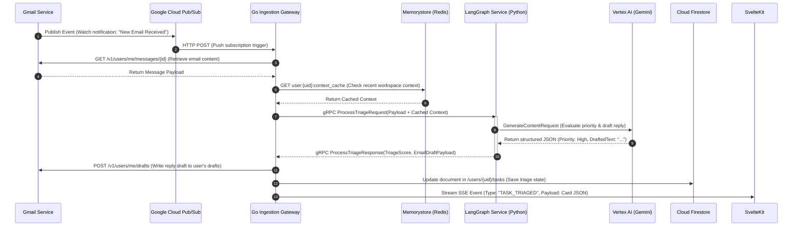
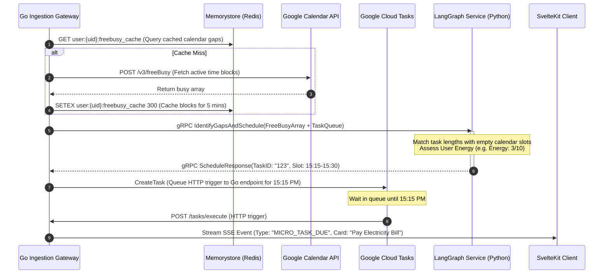
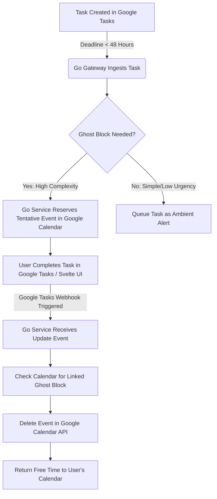
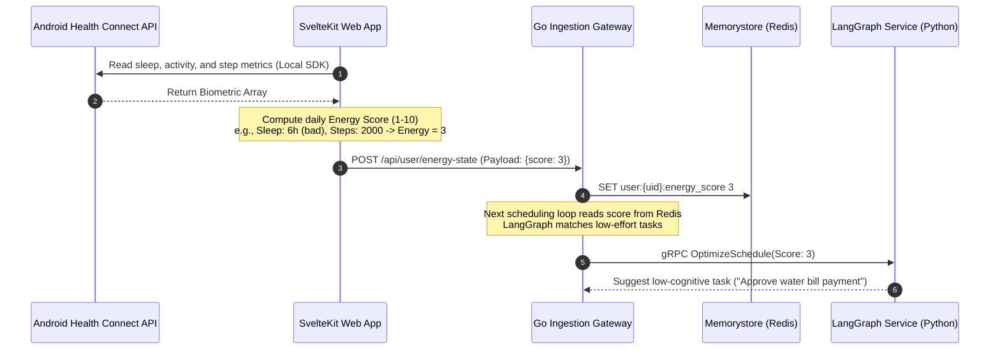

# Google-Grade Production System Architecture Document

## Project: The Last-Minute Life Saver (Productivity Agent)
### Document Version: 1.0.0
### Classification: Technical Design & System Architecture
### Target Runtime Environment: Google Cloud Platform (GCP)

---

## Section 1: Introduction & System Boundaries

This document defines the production-grade system architecture for "The Last-Minute Life Saver"—a proactive AI-powered productivity companion. The platform is designed to run on a serverless, decoupled microservices architecture on Google Cloud Platform, using SvelteKit for the frontend client, Go for synchronous integrations, and Python with LangGraph for stateful agent reasoning.

### 1.1 Service Architecture Overview

```
                      ┌──────────────────────────────────────┐
                      │    SvelteKit Web Client (Frontend)   │
                      └──────────────────┬───▲───────────────┘
                                   HTTPS │   │ Server-Sent Events (SSE)
                                   (REST)│   │ (Live Card Streams)
                                         ▼   │
┌────────────────────────────────────────┴───┴────────────────────────────────────────┐
│                                   GCP CLOUD RUN                                     │
│                                                                                     │
│  ┌──────────────────────────────────────┐     gRPC over HTTP/2     ┌─────────────┐  │
│  │         Go Ingestion Gateway         │◄────────────────────────►│   Python    │  │
│  │   - Port: 8080 (Ingress Gateway)     │  Proto: triage.proto     │  LangGraph  │  │
│  │   - Language: Go 1.22                │  Proto: scheduler.proto  │  Reasoning  │  │
│  │   - Binary Size: ~18MB (No runtime)  │                          │   Service   │  │
│  └──────────────────┬───────────────────┘                          └──────┬──────┘  │
└─────────────────────┼─────────────────────────────────────────────────────┼─────────┘
                      │                                                     │
      OAuth Actions / │                                                     │ Tool Calls /
      JSON Storage    ▼                                                     ▼ Context Checks
               ┌──────┴──────┐       Free-Busy Caches       ┌───────────────┴──────┐
               │  Firestore  │◄─────────────────────────────┤ Memorystore (Redis)  │
               │  Database   │   Sub-millisecond queries    │ - Port: 6379         │
               └─────────────┘                              └──────────────────────┘
```

#### 1.1.1 Go Ingestion Gateway (Gateway Service)
- **Role**: Serves as the primary ingress point for the client and handles all operations requiring low latency and high concurrency.
- **Key Responsibilities**:
  - Handles OAuth 2.0 redirection and callback flows.
  - Manages reads/writes to Firestore and handles Redis cache synchronization.
  - Synchronizes Google Workspace API states (Gmail drafts, Google Calendar events, Google Tasks items).
  - Streamlines Server-Sent Events (SSE) connections to the web client.
- **Performance Characteristics**: Extremely fast startup times (<200ms cold starts on Cloud Run), low memory footprint (~15MB baseline RAM), enabling instant scaling under load spike events.

#### 1.1.2 Python LangGraph Reasoning Service (AI Orchestrator)
- **Role**: Performs background reasoning, contextual analysis, and multi-turn planning.
- **Key Responsibilities**:
  - Manages task-triaging state machines via LangGraph.
  - Coordinates specialized sub-agents (Schedule Analyzer, Gmail Draft Writer, Biometric Profiler) as nodes in a graph.
  - Interacts with the Gemini API using the Vertex AI SDK.
- **Performance Characteristics**: Deployed as an asynchronous worker service on Cloud Run, optimized for CPU-heavy NLP operations, communicating internally with the Go Gateway via gRPC over HTTP/2.

---

## Section 2: Feature-Level Flows & Sequence Diagrams

This section outlines the step-by-step sequence of events for each of the core agentic capabilities of the platform.

### 2.1 Ingestion & Triage Pipeline

This flow is triggered in real-time when a user receives a new email or update in Gmail. The goal is to ingest the item, evaluate its importance, and draft a response before the user is notified.



---

### 2.2 Micro-Gap Scheduling Engine

This flow executes when the system detects an unallocated window in the user's calendar, matching it with an active, low-effort task that matches their energy level.



---

### 2.3 "Ghost" Time-Blocking & Self-Dissolving Reserve Pools

Proactively reserves time blocks on the calendar for high-priority tasks, and dissolves the block once the task is marked completed in Google Tasks.



---

### 2.4 Biometric & Cognitive Load Sync

Fetches biometric data locally from Health Connect and uses it to update the user's cognitive state in SvelteKit before forwarding the score to the backend.



---

## Section 3: Protobuf & gRPC Interface Contracts

To enforce strict, typed interfaces between the Go Gateway and the Python reasoning engine, communication is routed over gRPC using HTTP/2. The interface files are defined below:

### 3.1 `triage.proto`

```protobuf
syntax = "proto3";

package triage.v1;

option go_package = "github.com/lastminutelifesaver/gateway/gen/triage/v1;triagev1";

// Service handling inbound workspace events and prioritizing them
service TriageService {
  rpc ProcessTriage(ProcessTriageRequest) returns (ProcessTriageResponse);
}

message ProcessTriageRequest {
  string user_id = 1;
  string email_id = 2;
  string subject = 3;
  string sender = 4;
  string body_content = 5;
  int64 received_timestamp = 6;
  UserContext user_context = 7;
}

message UserContext {
  int32 energy_score = 1;
  string current_location = 2;
  repeated string active_task_tags = 3;
}

message ProcessTriageResponse {
  string task_id = 1;
  int32 triage_priority_score = 2; // Value from 1 to 100
  string urgency_level = 3;        // "AMBIENT", "QUIET", "CRITICAL"
  string action_type = 4;          // "GMAIL_DRAFT", "CALENDAR_BOOKING", "BILL_PAY"
  string draft_payload_json = 5;  // Pre-compiled parameters for execution
  string friction_saved_minutes = 6;
}
```

### 3.2 `scheduler.proto`

```protobuf
syntax = "proto3";

package scheduler.v1;

option go_package = "github.com/lastminutelifesaver/gateway/gen/scheduler/v1;schedulerv1";

// Service responsible for matching task slots with calendar gaps
service SchedulerService {
  rpc MatchSchedule(MatchScheduleRequest) returns (MatchScheduleResponse);
}

message MatchScheduleRequest {
  string user_id = 1;
  repeated CalendarEvent busy_slots = 2;
  repeated TaskItem task_pool = 3;
  int32 user_energy_score = 4;
}

message CalendarEvent {
  string event_id = 1;
  int64 start_time = 2;
  int64 end_time = 3;
  bool is_tentative = 4;
}

message TaskItem {
  string task_id = 1;
  string title = 2;
  int32 estimated_duration_minutes = 3;
  int32 priority = 4;
  int64 hard_deadline = 5;
}

message MatchScheduleResponse {
  string user_id = 1;
  repeated ScheduledAllocation allocations = 2;
}

message ScheduledAllocation {
  string task_id = 1;
  int64 start_time = 2;
  int64 end_time = 3;
  string allocation_type = 4; // "FOCUS_BLOCK", "MICRO_GAP"
  bool create_ghost_block = 5;
}
```

---

## Section 4: Database Schemas & Cache Key Specifications

### 4.1 Cloud Firestore Document Collections

Firestore runs in Native Mode. Below are the NoSQL document schemas for the primary collections:

```
/users (Collection)
  ├── {uid} (Document)
        ├── email: "sarah.pm@startup.com" (String)
        ├── created_at: Timestamp
        ├── energy_profile: Map
        │     ├── current_score: 8 (Integer)
        │     └── last_updated: Timestamp
        │
        ├── /tasks (Sub-collection)
        │     └── {task_id} (Document)
        │           ├── title: "Review Q3 Client Agreement" (String)
        │           ├── source: "GMAIL" (String)
        │           ├── status: "QUEUED" (String: QUEUED, ACTIVE, COMPLETED, IGNORED)
        │           ├── priority_score: 84 (Integer)
        │           ├── estimated_duration: 30 (Integer)
        │           ├── due_at: Timestamp
        │           └── action_card: Map
        │                 ├── action_type: "GMAIL_DRAFT" (String)
        │                 ├── saves_minutes: 15 (Integer)
        │                 ├── draft_id: "draft_abc123" (String)
        │                 └── payload: "{'to': 'client@acme.com', 'body': '...'}" (String/JSON)
        │
        └── /schedules (Sub-collection)
              └── {allocation_id} (Document)
                    ├── task_id: "task_xyz789" (String)
                    ├── start_time: Timestamp
                    ├── end_time: Timestamp
                    ├── allocation_type: "GHOST_BLOCK" (String)
                    ├── calendar_event_id: "cal_evt_998877" (String)
                    └── status: "RESERVED" (String: RESERVED, DISSOLVED, COMMITTED)
```

#### 4.1.1 Indexing Policies (Firestore)
To support fast real-time dashboard renders, we configure composite indexes in `firestore.indexes.json`:
- **Index 1**: Collection `/tasks` queryable on: `status` (Ascending) + `priority_score` (Descending) + `due_at` (Ascending).
- **Index 2**: Collection `/schedules` queryable on: `status` (Ascending) + `start_time` (Ascending).

---

### 4.2 Memorystore Redis Keyspaces

Redis is deployed on Google Cloud Memorystore with eviction policy set to `volatile-lru` (Least Recently Used with TTL expiration).

| Cache Key Pattern | Data Type | TTL (Sec) | Purpose | Example Payload |
| :--- | :--- | :---: | :--- | :--- |
| `user:{uid}:freebusy_cache` | String (JSON) | 300 | Caches calendar busy blocks to prevent API rate limiting. | `[{"start":17800000,"end":17803600}]` |
| `user:{uid}:energy_score` | String | 3600 | Caches the computed Health Connect energy score. | `"7"` |
| `lock:calendar:{uid}:{event_id}` | String | 30 | Distributed lock to prevent double-booking slot races. | `"locked"` |
| `user:{uid}:active_sse_stream` | String | 120 | Tracks active client connection ID for routing events. | `"conn_gateway_abc123"` |

---

## Section 5: Infrastructure-as-Code (Terraform HCL) & IAM

Production deployments use Terraform to define resource mappings and access controls following least-privilege principles.

### 5.1 Terraform Provisioning Config (`main.tf`)

```hcl
terraform {
  required_version = ">= 1.5.0"
  required_providers {
    google = {
      source  = "hashicorp/google"
      version = "~> 5.10.0"
    }
  }
}

provider "google" {
  project = var.project_id
  region  = var.region
}

# --- KMS Cryptographic Key Ring (For Envelope Encryption) ---
resource "google_kms_key_ring" "keyring" {
  name     = "last-minute-saver-keyring"
  location = var.region
}

resource "google_kms_crypto_key" "token_encryption_key" {
  name     = "user-refresh-token-key"
  key_ring = google_kms_key_ring.keyring.id
  purpose  = "ENCRYPT_DECRYPT"

  rotation_period = "7776000s" # 90 days automatic key rotation
}

# --- Cloud Run: Go Ingestion Gateway ---
resource "google_cloud_run_v2_service" "go_gateway" {
  name     = "go-ingestion-gateway"
  location = var.region

  template {
    service_account = google_service_account.gateway_sa.email
    containers {
      image = "${var.region}-docker.pkg.dev/${var.project_id}/app-repo/go-gateway:latest"
      ports {
        container_port = 8080
      }
      env {
        name  = "PROJECT_ID"
        value = var.project_id
      }
      env {
        name  = "REDIS_HOST"
        value = var.redis_host
      }
      env {
        name  = "KMS_KEY_ID"
        value = google_kms_crypto_key.token_encryption_key.id
      }
    }
  }
}

# --- Cloud Run: Python LangGraph Agent ---
resource "google_cloud_run_v2_service" "python_agent" {
  name     = "python-langgraph-agent"
  location = var.region

  template {
    service_account = google_service_account.agent_sa.email
    containers {
      image = "${var.region}-docker.pkg.dev/${var.project_id}/app-repo/python-agent:latest"
      ports {
        container_port = 50051 # gRPC port
      }
      env {
        name  = "PROJECT_ID"
        value = var.project_id
      }
    }
  }
}

# --- Cloud Tasks Queue (Micro-gap Trigger Queue) ---
resource "google_cloud_tasks_queue" "gap_scheduler_queue" {
  name     = "gap-scheduler-queue"
  location = var.region

  rate_limits {
    max_concurrent_dispatches = 100
    max_dispatches_per_second = 50.0
  }

  retry_config {
    max_attempts       = 5
    min_backoff        = "2s"
    max_backoff        = "60s"
    max_doublings      = 4
  }
}

# --- Cloud Pub/Sub Topic (For Gmail Real-Time Push Events) ---
resource "google_pubsub_topic" "gmail_watch_topic" {
  name = "gmail-mailbox-watch-events"
}

resource "google_pubsub_subscription" "gmail_push_subscription" {
  name  = "gmail-mailbox-push-sub"
  topic = google_pubsub_topic.gmail_watch_topic.name

  push_config {
    push_endpoint = "${google_cloud_run_v2_service.go_gateway.uri}/webhooks/gmail"
    oidc_token {
      service_account_email = google_service_account.pubsub_invoker.email
    }
  }
}
```

---

### 5.2 IAM Least-Privilege Role Bindings

To secure the production boundary, separate service accounts are declared for each service with minimal permissions.

```hcl
# --- Service Accounts ---
resource "google_service_account" "gateway_sa" {
  account_id   = "ingestion-gateway-sa"
  display_name = "Ingestion Gateway Service Account"
}

resource "google_service_account" "agent_sa" {
  account_id   = "langgraph-agent-sa"
  display_name = "LangGraph Agent Service Account"
}

resource "google_service_account" "pubsub_invoker" {
  account_id   = "pubsub-invoker-sa"
  display_name = "PubSub Cloud Run Invoker Service Account"
}

# --- Go Gateway IAM Bindings ---
# 1. Permission to write to Firestore
resource "google_project_iam_member" "gateway_firestore" {
  project = var.project_id
  role    = "roles/datastore.user"
  member  = "serviceAccount:${google_service_account.gateway_sa.email}"
}

# 2. Permission to decrypt/encrypt tokens using Cloud KMS
resource "google_kms_crypto_key_iam_member" "gateway_kms" {
  crypto_key_id = google_kms_crypto_key.token_encryption_key.id
  role          = "roles/cloudkms.cryptoKeyEncrypterDecrypter"
  member        = "serviceAccount:${google_service_account.gateway_sa.email}"
}

# 3. Permission to queue execution calls in Cloud Tasks
resource "google_project_iam_member" "gateway_tasks" {
  project = var.project_id
  role    = "roles/cloudtasks.enqueuer"
  member  = "serviceAccount:${google_service_account.gateway_sa.email}"
}

# --- Python LangGraph Agent IAM Bindings ---
# 1. Permission to call Vertex AI API to execute Gemini
resource "google_project_iam_member" "agent_vertex" {
  project = var.project_id
  role    = "roles/aiplatform.user"
  member  = "serviceAccount:${google_service_account.agent_sa.email}"
}

# --- Pub/Sub Invoker IAM Bindings ---
# 1. Permission to call the Go Gateway webhook endpoint
resource "google_cloud_run_v2_service_iam_member" "pubsub_invokes_gateway" {
  name     = google_cloud_run_v2_service.go_gateway.name
  location = var.region
  role     = "roles/run.invoker"
  member   = "serviceAccount:${google_service_account.pubsub_invoker.email}"
}
```
